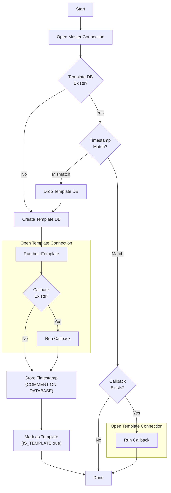
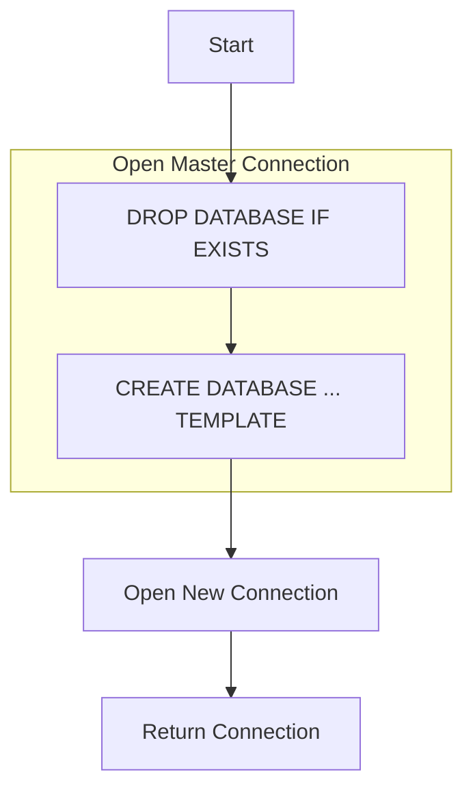

#  Elforyn

include: intro

**See [Milestones](../../milestones?state=closed) for release notes.**

toc
  * [Design](/pages/design.md)
  * [EntityFramework Usage](/pages/ef-usage.md)
  * [EntityFramework NUnit Usage](/pages/ef-nunit-usage.md)
  * [EntityFramework xunit.v3 Usage](/pages/ef-xunitv3-usage.md)
  * [EntityFramework MSTest Usage](/pages/ef-mstest-usage.md)
  * [EntityFramework TUnit Usage](/pages/ef-tunit-usage.md)
  * [EntityFramework Migrations](/pages/efmigrations.md)
  * [Logging](/pages/logging.md)
  * [Template Re-generation](/pages/template-regen.md)

## NuGet packages

  * https://www.nuget.org/packages/Elforyn/
  * https://www.nuget.org/packages/Elforyn.NUnit/
  * https://www.nuget.org/packages/Elforyn.Xunit.V3/
  * https://www.nuget.org/packages/Elforyn.MSTest/
  * https://www.nuget.org/packages/Elforyn.TUnit/

## Why

### Goals

 * Have an isolated PostgreSQL Database for each unit test method.
 * Does not overly impact performance.
 * Results in a running PostgreSQL Database that can be accessed via [pgAdmin](https://www.pgadmin.org/) (or other tooling) to diagnose issues when a test fails.

### Why not SQLite

 * SQLite and PostgreSQL do not have compatible feature sets and there are incompatibilities between their query languages.

### Why not [EntityFramework InMemory](https://docs.microsoft.com/en-us/ef/core/providers/in-memory/)

 * Difficult to debug the state. When debugging a test, or looking at the resultant state, it is helpful to be able to interrogate the Database using tooling
 * InMemory is implemented with shared mutable state between instance. This results in strange behaviors when running tests in parallel, for example when [creating keys](https://github.com/aspnet/EntityFrameworkCore/issues/6872).
 * InMemory is not intended to be an alternative to a relational database, and as such it does not support the full suite of relational features.

See the official guidance: [InMemory is not a relational database](https://docs.microsoft.com/en-us/ef/core/miscellaneous/testing/in-memory#inmemory-is-not-a-relational-database).

## Usage

This project supports several approaches.

### EntityFramework Core

Interactions with PostgreSQL via [Entity Framework Core](https://docs.microsoft.com/en-us/ef/core/).

[Full Usage](/pages/ef-usage.md)

### EntityFramework Core NUnit

NUnit test base class wrapping Elforyn with Arrange-Act-Assert phase enforcement.

[Full Usage](/pages/ef-nunit-usage.md)

### EntityFramework Core xunit.v3

xunit.v3 test base class wrapping Elforyn with Arrange-Act-Assert phase enforcement.

[Full Usage](/pages/ef-xunitv3-usage.md)

### EntityFramework Core MSTest

MSTest test base class wrapping Elforyn with Arrange-Act-Assert phase enforcement.

[Full Usage](/pages/ef-mstest-usage.md)

### EntityFramework Core TUnit

TUnit test base class wrapping Elforyn with Arrange-Act-Assert phase enforcement.

[Full Usage](/pages/ef-tunit-usage.md)

## How this project works

### Inputs

#### buildTemplate

A delegate that builds the template database schema. Called zero or once based on the current state of the underlying PostgreSQL template:

 * **Not called** if a valid template already exists (timestamp matches)
 * **Called once** if the template needs to be created or rebuilt

The delegate receives a connected DbContext to create schema and seed initial data.

#### timestamp

A timestamp used to determine if the template database needs to be rebuilt:

 * If the timestamp is **newer** than the existing template, the template is recreated
 * Defaults to the last modified time of the `TDbContext` assembly

#### callback

A delegate executed after the template database has been created or mounted:

 * **Guaranteed to be called exactly once** per `PgInstance` at startup
 * Receives a NpgsqlConnection and DbContext for seeding reference data or post-creation setup
 * Called regardless of whether `buildTemplate` ran (useful for setup that must always occur)

### PgInstance Startup Flow

This flow happens once per `PgInstance`, usually once before any tests run.

### Create PgDatabase Flow

This happens once per `PgInstance.Build`, usually once per test method.

## Debugging

To connect to the PostgreSQL instance use [pgAdmin](https://www.pgadmin.org/) or any PostgreSQL client with the connection string used to initialize the `PgInstance`.

The connection details will be written to [Trace.WriteLine](https://docs.microsoft.com/en-us/dotnet/api/system.diagnostics.trace.writeline) when a PgInstance is constructed. See [Logging](/pages/logging.md).

## Icon

[Elephant](https://thenounproject.com/icon/elephant-8188383/) from [The Noun Project](https://thenounproject.com/).